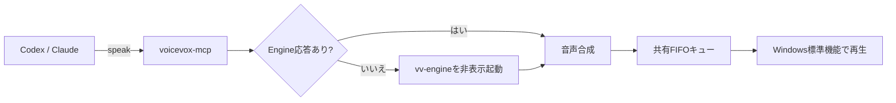

# voicevox-mcp

AIアシスタントの最終回答や作業完了報告を、VOICEVOXの音声で読み上げるWindows向けMCPサーバーです。既定では「ずんだもん（ノーマル）」を話速`1.1`で使います。

Codex Desktop / CLI、Claude Code、Claude Desktopに対応します。フックは使わず、MCPサーバー自身の指示とグローバルな`AGENTS.md` / `CLAUDE.md`を組み合わせます。

> [!IMPORTANT]
> このリポジトリはVOICEVOX、ずんだもん、各AIクライアントの公式プロジェクトではありません。VOICEVOX本体や音声モデルは同梱しません。

## 特長

- VOICEVOX Engineが起動済みなら`127.0.0.1:50021`へ接続
- 停止中ならインストール済みの`vv-engine\run.exe`を非表示でバックグラウンド起動
- 実行ファイルがなければ自動ダウンロードせず、設定方法を含むエラーを返す
- 複数のAIクライアントから呼ばれても、1本ずつFIFOで非同期再生
- `stop_speaking`で再生中の音声と待機キューを停止
- 読み上げ本文をログへ保存せず、一時WAVは再生後に削除
- VLC、ffmpeg、Docker、ネイティブNode.jsアドオン不要
- npmとClaude Desktop用MCPBの両方で配布可能



## 必要環境

- Windows 10 / 11
- [VOICEVOX](https://voicevox.hiroshiba.jp/) デスクトップ版
- npm経由で使う場合はNode.js 22以上

VOICEVOXは通常のインストーラーで一度インストールしてください。アプリ画面を開いたままにする必要はありません。標準インストール先以外を使う場合は、後述の`VOICEVOX_ENGINE_PATH`を設定します。

## npmでインストールする

### 方法A: npxで使う（推奨）

グローバルインストールせず、AIクライアントから次のコマンドを起動します。

```powershell
npx.cmd -y voicevox-mcp
```

初回だけnpmからパッケージを取得します。Codex / Claudeの設定例も、この方法を使っています。

### 方法B: グローバルインストール

```powershell
npm.cmd install --global voicevox-mcp
voicevox-mcp --version
voicevox-mcp doctor
```

`doctor`は接続先、Engine実行ファイル候補、再生キューを表示します。診断だけではEngineを自動起動しません。

> [!NOTE]
> npmへ公開する前にこのリポジトリを直接試す場合は、リポジトリ内で`npm.cmd install`、`npm.cmd run build`を実行し、設定のコマンドを`node`、引数を`C:\path\to\voicevox-mcp\dist\index.js`に置き換えてください。

## Codex Desktop / CLIへ登録する

Codex Desktop、Codex CLI、IDE拡張は同じ`%USERPROFILE%\.codex\config.toml`を共有します。

PowerShellから登録する場合:

```powershell
codex mcp add voicevox -- npx.cmd -y voicevox-mcp
```

設定ファイルへ直接書く場合:

```toml
[mcp_servers.voicevox]
command = "npx.cmd"
args = ["-y", "voicevox-mcp"]
startup_timeout_sec = 30
tool_timeout_sec = 60

[mcp_servers.voicevox.env]
VOICEVOX_SPEED_SCALE = "1.1"
```

完全な例は[`examples/codex-config.toml`](examples/codex-config.toml)にあります。保存後、Codexを再起動し、`/mcp`またはMCPサーバー設定画面で`voicevox`を確認します。

## Claude Codeへ登録する

Windowsネイティブ版のPowerShellで、ユーザースコープへ登録します。

```powershell
claude mcp add --transport stdio --scope user voicevox -- npx.cmd -y voicevox-mcp
claude mcp list
```

JSON形式の例は[`examples/claude-code.mcp.json`](examples/claude-code.mcp.json)にあります。

## Claude Desktopへ登録する

GitHub Releasesから`voicevox-mcp.mcpb`を取得し、Claude Desktopの **Settings → Extensions → Advanced settings → Install Extension** から選択する方法を推奨します。MCPBには実行時依存を同梱するため、利用者によるnpm操作は不要です。

開発版MCPBを作る場合:

```powershell
npm.cmd install
npm.cmd run mcpb:stage
npm.cmd run mcpb:validate
npm.cmd run mcpb:pack
```

生成先は`build\voicevox-mcp.mcpb`です。

## 読み上げルールを全プロジェクトへ設定する

フックを使わない場合、モデルによるツール呼び出しは100%の強制ではありません。このサーバーはMCPの`instructions`でも利用条件を通知し、さらにクライアントのグローバル指示を併用する二重構成にしています。

### Codex

[`templates/AGENTS.snippet.md`](templates/AGENTS.snippet.md)の「音声読み上げ」節を、`%USERPROFILE%\.codex\AGENTS.md`へ追記します。既存の個人ルールがある場合はファイルを置き換えず、節だけを統合してください。

### Claude Code

[`templates/CLAUDE.global.md`](templates/CLAUDE.global.md)の内容を、`%USERPROFILE%\.claude\CLAUDE.md`へ統合します。

### Claude Desktop

[`templates/claude-desktop-instructions.md`](templates/claude-desktop-instructions.md)をClaudeのプロフィール指示へ追加します。

ルールの要点は次のとおりです。

- 読む: 最終回答、作業完了、エラー、ユーザーの確認待ち
- 読まない: 通常の途中経過
- 音声: 画面に表示する結論と同じ内容を、2〜4文・180文字以内へ要約
- 文体: 会話画面は自然なずんだもんらしさを出す。すべての文へ機械的に「なのだ」を付けない
- 成果物: README、仕様書、コード、コメント、コマンド、エラー本文は通常の文体
- 安全: コード、URL、秘密情報、長いパスは読み上げない
- 障害時: 音声失敗を理由に本来の回答を止めない

## MCPツール

| ツール | 動作 | Engine自動起動 |
|---|---|---:|
| `speak` | テキストを合成し、共有FIFOへ追加 | する |
| `voicevox_status` | 接続、実行ファイル候補、キューを確認 | しない |
| `list_voices` | キャラクター、スタイル、IDを一覧化 | しない |
| `stop_speaking` | 再生中の音声を停止し、待機キューを消去 | しない |

`speak`の主な引数:

```json
{
  "text": "作業は無事に完了したのだ。テストも全部通ったよ。",
  "character": "ずんだもん",
  "style": "ノーマル",
  "speedScale": 1.1
}
```

`speakerId`を指定した場合は、`character`と`style`より優先されます。

## 設定

MCPクライアントの`env`またはPowerShellの環境変数で変更できます。

| 環境変数 | 既定値 | 説明 |
|---|---|---|
| `VOICEVOX_ENGINE_URL` | `http://127.0.0.1:50021` | EngineのURL。指定時はHOST/PORTより優先 |
| `VOICEVOX_HOST` | `127.0.0.1` | Engineのホスト |
| `VOICEVOX_PORT` | `50021` | Engineのポート |
| `VOICEVOX_ENGINE_PATH` | 自動検出 | `vv-engine\run.exe`の絶対パス |
| `VOICEVOX_AUTO_START` | `true` | 停止時にEngineを起動するか |
| `VOICEVOX_CHARACTER` | `ずんだもん` | 既定キャラクター |
| `VOICEVOX_STYLE` | `ノーマル` | 既定スタイル |
| `VOICEVOX_SPEAKER_ID` | 未指定 | 名前解決より優先するスタイルID |
| `VOICEVOX_SPEED_SCALE` | `1.1` | 既定話速（0.5〜2） |
| `VOICEVOX_MCP_DATA_DIR` | `%LOCALAPPDATA%\voicevox-mcp` | キュー、ロック、ログの保存先 |
| `VOICEVOX_START_TIMEOUT_MS` | `45000` | 自動起動の待機時間 |
| `VOICEVOX_REQUEST_TIMEOUT_MS` | `15000` | API要求の待機時間 |
| `VOICEVOX_MAX_TEXT_LENGTH` | `1000` | ツールが受け付ける最大文字数 |

標準のEngine候補は次の順で確認します。

1. `VOICEVOX_ENGINE_PATH`
2. `%LOCALAPPDATA%\Programs\VOICEVOX\vv-engine\run.exe`
3. `%LOCALAPPDATA%\Programs\VOICEVOX\run.exe`

自動起動はWindowsのループバックHTTP接続だけで有効です。指定ポートに別アプリが応答した場合、そのプロセスを終了せず設定エラーにします。起動したEngineは読み上げ後も終了しません。

## トラブルシューティング

| 症状 | 確認方法 |
|---|---|
| `ENGINE_NOT_FOUND` | VOICEVOXをインストールし、必要なら`VOICEVOX_ENGINE_PATH`を設定 |
| `ENGINE_ENDPOINT_INVALID` | `voicevox-mcp doctor`でURLを確認し、ポート競合またはURLを修正 |
| 音が出ない | Windowsの出力デバイスと音量、`%LOCALAPPDATA%\voicevox-mcp\logs\playback.log`を確認 |
| 音声一覧がエラー | `list_voices`は自動起動しないため、VOICEVOXを起動して再試行 |
| AIが読み上げない | MCP接続、グローバル指示、ツールの承認状態を確認 |
| 読み上げが重なる | 同じ`VOICEVOX_MCP_DATA_DIR`を全クライアントで使用しているか確認 |

診断コマンド:

```powershell
npx.cmd -y voicevox-mcp doctor
Invoke-RestMethod http://127.0.0.1:50021/version
```

## プライバシーと安全性

- 通信先の既定値はローカルホストだけです。
- 読み上げ本文はジョブJSONやログへ保存しません。
- 合成WAVは`%LOCALAPPDATA%\voicevox-mcp\queue`へ一時保存し、再生後に削除します。
- Engineの自動ダウンロード、GUIの自動起動、既存プロセスの強制終了は行いません。
- `stop_speaking`が終了対象にするのは、このサーバーが開始したWAV再生用PowerShellプロセスだけです。

## 開発

```powershell
npm.cmd install
npm.cmd run lint
npm.cmd run typecheck
npm.cmd test
npm.cmd run version:check
npm.cmd run build
npm.cmd pack --dry-run
```

実際のVOICEVOX Engineを停止して自動起動テストを行う必要はありません。単体テストはモックと別の一時ディレクトリを使い、利用中のEngineへ干渉しません。

公開手順は[`docs/releasing.md`](docs/releasing.md)を参照してください。
内部構成と設計判断は[`docs/design.md`](docs/design.md)にまとめています。

## クレジットとライセンス

- 本ソフトウェア: [MIT License](LICENSE)
- 音声: VOICEVOXの利用規約、および各音声ライブラリの利用規約に従ってください。
- ずんだもん音声を利用・公開する際のクレジット表記例: `VOICEVOX:ずんだもん`

関連する公式情報:

- [VOICEVOX](https://voicevox.hiroshiba.jp/)
- [VOICEVOX Engine API](https://voicevox.github.io/voicevox_engine/api/)
- [VOICEVOX音声ライブラリ利用規約](https://zunko.jp/con_ongen_kiyaku.html)
- [Model Context Protocol](https://modelcontextprotocol.io/)
- [CodexのMCP設定](https://learn.chatgpt.com/docs/extend/mcp)
- [MCP Bundles (MCPB)](https://github.com/modelcontextprotocol/mcpb)
